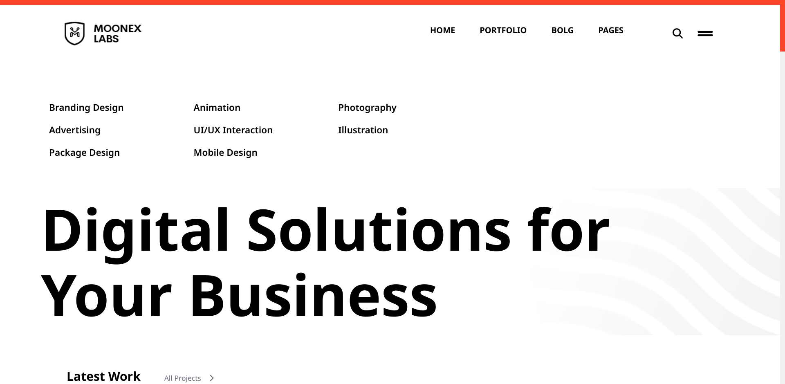
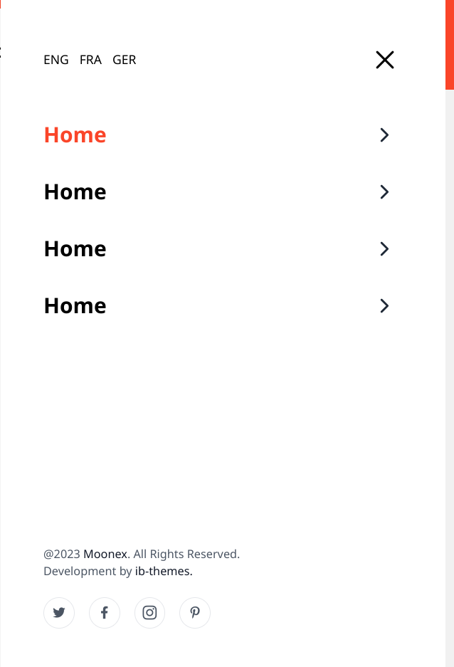
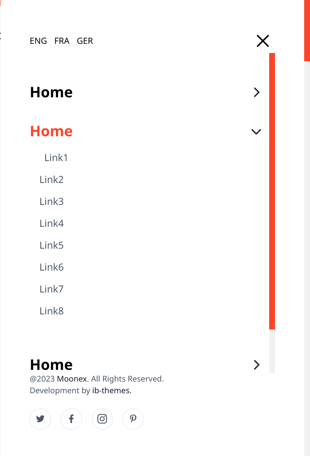
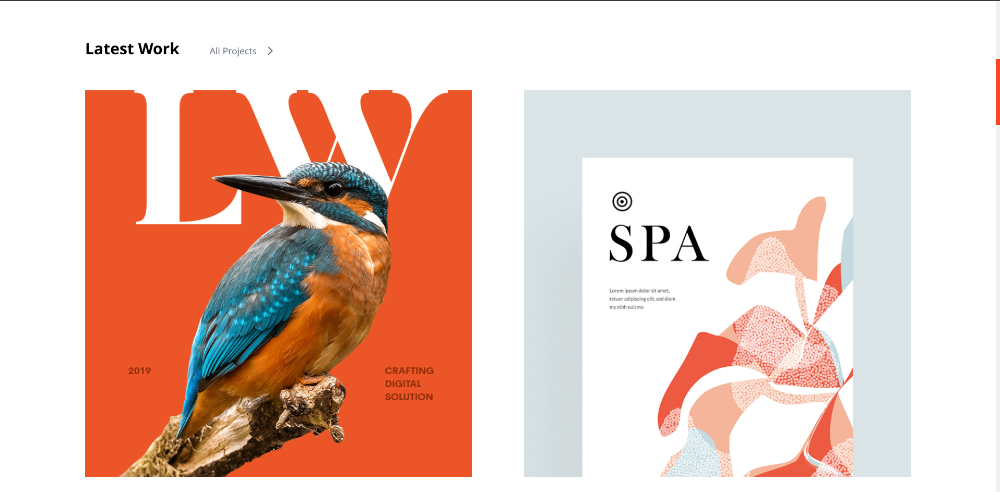
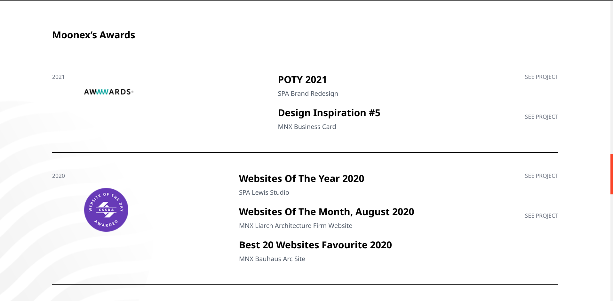
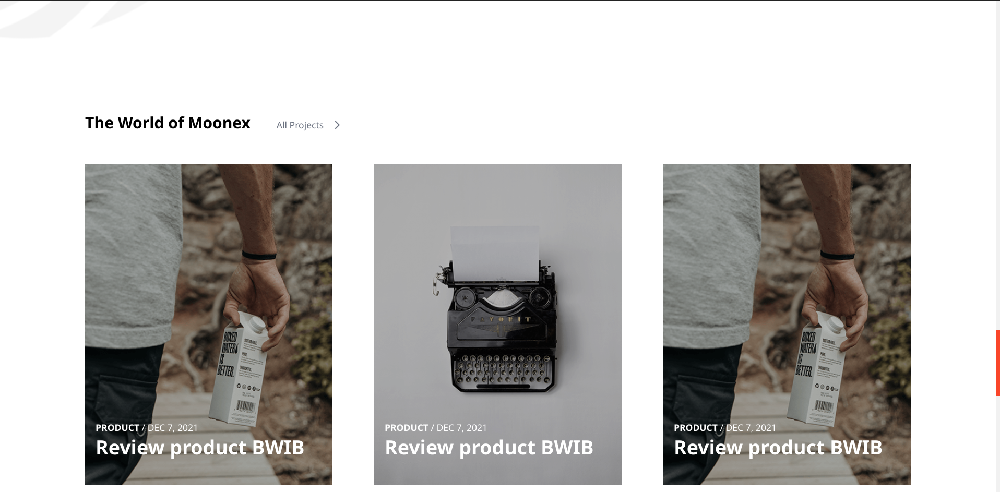
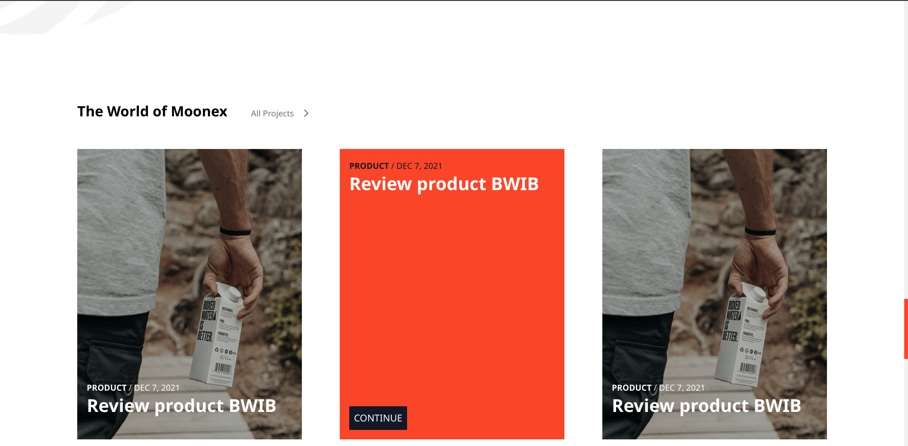
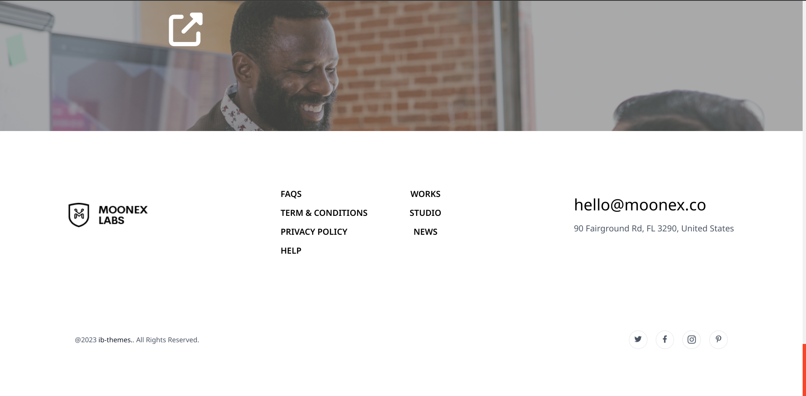
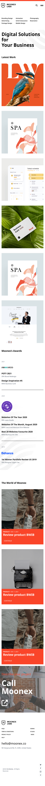

# AZAD PROJECT

Description:

This repository contains the codebase for a training project completed during my internship at Azad Company. The project is a simple yet fully functional web application created using HTML, CSS, and JavaScript. It serves as a demonstration of my skills and experience gained during the internship ,the project is services web page.

## Key Features:

   Technology Stack: Built with HTML, CSS, and JavaScript, following industry best practices.
    User Interface: A clean and intuitive user interface designed for ease of use.
    Interactive Elements: Utilizes JavaScript to add interactive features, enhancing user engagement.
    Performance Optimization: Implements various performance optimization techniques for fast loading times.
    Responsive Design: Ensures compatibility with various screen sizes and devices.
    Image Optimization: Optimizes image assets for efficient loading and rendering.
    Code Structure: Organized and well-commented code for maintainability and readability.
    Documentation: Includes documentation on how to set up and run the project locally.
    Demo: Provides a live demo of the project hosted here.

## pages

# Project Overview:

During my internship at Azad Company, I worked on this project to strengthen my web development skills. The project simulates a one-page website for Azad Company and serves as a hands-on training exercise in HTML, CSS, and JavaScript. It incorporates responsive design, image optimization, and interactive features, showcasing my ability to create a functional and user-friendly web application.

# Usage:

## To run the project locally, follow the instructions in the documentation provided in this repository. You can also access a live demo of the project here :
1/ fork this project
2/ clone this project
3/ open this project in VS code editor or any editor
4/ open HTML file 
5/ click at alt+l+o to run server localhost
6/ let's get started

# Contact:

For inquiries or collaboration opportunities, you can reach me at abdellah.becherair04@gmail.com .